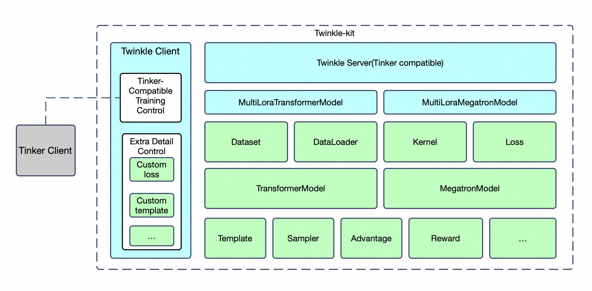
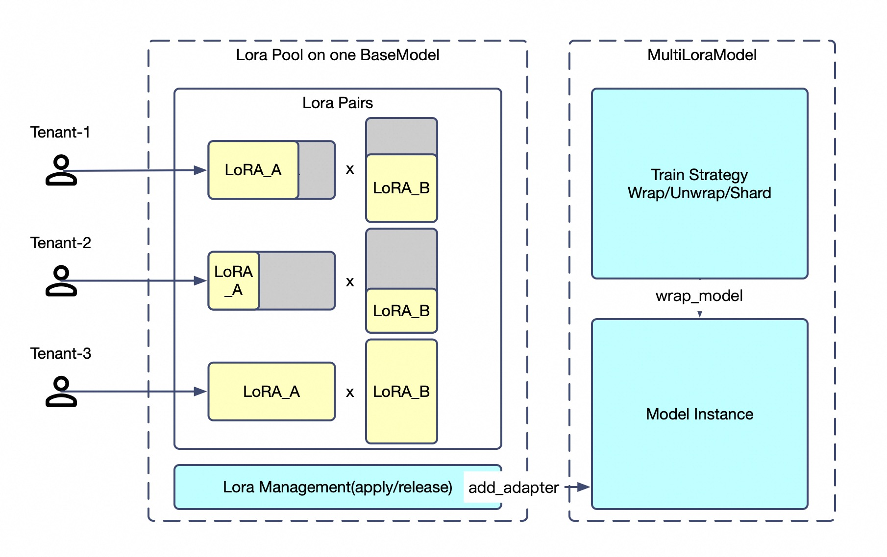

<h1 align="center">Twinkle: <b>T</b>raining <b>W</b>orkbench for <b>I</b>ndustrial <b>N</b>eural-network <b>K</b>it & <b>L</b>LM <b>E</b>ngineering</h1>

<p align="center">
    <br>
    
    <br>
<p>
<p align="center">
<a href="https://modelscope.cn/home">The Modelscope Community</a>
<br>
        English&nbsp ｜ &nbsp<a href="README_ZH.md">中文</a>&nbsp
</p>

<p align="center">


<a href="https://pypi.org/project/twinkle/"></a>
<a href="https://github.com/modelscope/twinkle/blob/main/LICENSE"></a>
<a href="https://pepy.tech/project/twinkle-kit"></a>
<a href="https://github.com/modelscope/twinkle/pulls"></a>
</p>

<p align="center">
        <a href="https://twinkle-kit.readthedocs.io/en/latest/">English Documentation</a> &nbsp ｜ &nbsp <a href="https://twinkle-kit.readthedocs.io/zh-cn/latest/">中文文档</a> &nbsp
</p>

<div align="center">

## ✨ What is Twinkle?

A component library for large model training. Based on PyTorch, simpler, more flexible, production-ready.

<p align="center">
🧩 <b>Loosely Coupled Architecture</b> · Standardized Interfaces<br>
🚀 <b>Multiple Runtime Modes</b> · torchrun / Ray / HTTP<br>
🔌 <b>Multi-Framework Compatible</b> · Transformers / Megatron<br>
👥 <b>Multi-Tenant Support</b> · Single Base Model Deployment
</p>

</div>

## Installation

Install using pip:

```shell
pip install 'twinkle-kit'
```

## Installation from Source

```shell
git clone https://github.com/modelscope/twinkle.git
cd twinkle
pip install -e . --no-build-isolation
```

## Tutorial Examples

| Training Type                     | Model Framework | Cookbook Path                            |
| --------------------------------- | --------------- | ---------------------------------------- |
| FSDP finetuning                   | transformers    | [Script](cookbook/transformers/fsdp2.py)      |
| FSDP MoE finetuning               | transformers    | [Script](cookbook/transformers/fsdp2_moe.py)  |
| pp/tp/cp finetuning               | megatron        | [Script](cookbook/megatron/tp.py)             |
| pp/tp/cp MoE finetuning           | megatron        | [Script](cookbook/megatron/tp_moe.py)         |
| tinker client finetuning          | megatron        | [Script](cookbook/client/tinker/megatron)     |
| tinker client finetuning/sampling | transformers    | [Script](cookbook/client/tinker/transformer)  |
| twinkle client finetuning         | megatron        | [Script](cookbook/client/twinkle/megatron)    |
| twinkle client finetuning         | transformer     | [Script](cookbook/client/twinkle/transformer) |

## Changelog

- 🎉2026-02-10 Completed the first version of twinkle-kit, including pure text model SFT/PT/RL and remote training capabilities, with support for [ModelScope official free resources]()

## Supported Hardware

| Hardware Environment            | Notes                                    |
| ------------------------------- | ---------------------------------------- |
| GPU A10/A100/H100/RTX series    |                                          |
| GPU T4/V100                     | Does not support bfloat16, Flash-Attention |
| Ascend NPU                      | Some operators not supported             |
| PPU                             | Supported                                |
| CPU                             | Supports partial components like dataset, dataloader |

## Supported Large Language Models

| Model Type          | Model ID Example                                                                                           | Requires             | Support Megatron | HF Model ID                                                                                                |
| ------------------- | ---------------------------------------------------------------------------------------------------------- | -------------------- | ---------------- | ---------------------------------------------------------------------------------------------------------- |
| qwen2 series        | [Qwen/Qwen2-0.5B-Instruct](https://modelscope.cn/models/Qwen/Qwen2-0.5B-Instruct) ~72B                    | transformers>=4.37   | ✔               | [Qwen/Qwen2-0.5B-Instruct](https://huggingface.co/Qwen/Qwen2-0.5B-Instruct)                                   |
|                     | [Qwen/Qwen2-72B](https://modelscope.cn/models/Qwen/Qwen2-72B)~72B                                         | transformers>=4.37   | ✔               | [Qwen/Qwen2-1.5B](https://huggingface.co/Qwen/Qwen2-1.5B)                                                     |
|                     | [Qwen/Qwen2.5-0.5B-Instruct](https://modelscope.cn/models/Qwen/Qwen2.5-0.5B-Instruct)~72B                 | transformers>=4.37   | ✔               | [Qwen/Qwen2.5-0.5B-Instruct](https://huggingface.co/Qwen/Qwen2.5-0.5B-Instruct)                               |
|                     | [Qwen/Qwen2.5-0.5B](https://modelscope.cn/models/Qwen/Qwen2.5-0.5B)~72B                                   | transformers>=4.37   | ✔               | [Qwen/Qwen2.5-0.5B](https://huggingface.co/Qwen/Qwen2.5-0.5B)                                                 |
| qwen2_moe series    | [Qwen/Qwen1.5-MoE-A2.7B-Chat](https://modelscope.cn/models/Qwen/Qwen1.5-MoE-A2.7B-Chat)                   | transformers>=4.40   | ✔               | [Qwen/Qwen1.5-MoE-A2.7B-Chat](https://huggingface.co/Qwen/Qwen1.5-MoE-A2.7B-Chat)                             |
| qwen3 series        | [Qwen/Qwen3-0.6B-Base](https://modelscope.cn/models/Qwen/Qwen3-0.6B-Base)~32B                             | transformers>=4.51   | ✔               | [Qwen/Qwen3-0.6B-Base](https://huggingface.co/Qwen/Qwen3-0.6B-Base)                                           |
| qwen3_moe series    | [Qwen/Qwen3-30B-A3B-Base](https://modelscope.cn/models/Qwen/Qwen3-30B-A3B-Base)                           | transformers>=4.51   | ✔               | [Qwen/Qwen3-30B-A3B-Base](https://huggingface.co/Qwen/Qwen3-30B-A3B-Base)                                     |
|                     | [Qwen/Qwen3-30B-A3B](https://modelscope.cn/models/Qwen/Qwen3-30B-A3B)~235B                                | transformers>=4.51   | ✔               | [Qwen/Qwen3-30B-A3B](https://huggingface.co/Qwen/Qwen3-30B-A3B)                                               |
| chatglm2 series     | [ZhipuAI/chatglm2-6b](https://modelscope.cn/models/ZhipuAI/chatglm2-6b)                                   | transformers<4.42    | ✘               | [zai-org/chatglm2-6b](https://huggingface.co/zai-org/chatglm2-6b)                                             |
|                     | [ZhipuAI/chatglm2-6b-32k](https://modelscope.cn/models/ZhipuAI/chatglm2-6b-32k)                           | transformers<4.42    | ✘               | [zai-org/chatglm2-6b-32k](https://huggingface.co/zai-org/chatglm2-6b-32k)                                     |
| chatglm3 series     | [ZhipuAI/chatglm3-6b](https://modelscope.cn/models/ZhipuAI/chatglm3-6b)                                   | transformers<4.42    | ✘               | [zai-org/chatglm3-6b](https://huggingface.co/zai-org/chatglm3-6b)                                             |
|                     | [ZhipuAI/chatglm3-6b-base](https://modelscope.cn/models/ZhipuAI/chatglm3-6b-base)                         | transformers<4.42    | ✘               | [zai-org/chatglm3-6b-base](https://huggingface.co/zai-org/chatglm3-6b-base)                                   |
|                     | [ZhipuAI/chatglm3-6b-32k](https://modelscope.cn/models/ZhipuAI/chatglm3-6b-32k)~128k                      | transformers<4.42    | ✘               | [zai-org/chatglm3-6b-32k](https://huggingface.co/zai-org/chatglm3-6b-32k)                                     |
| chatglm4 series     | [ZhipuAI/glm-4-9b-chat](https://modelscope.cn/models/ZhipuAI/glm-4-9b-chat)                               | transformers>=4.42   | ✘               | [zai-org/glm-4-9b-chat](https://huggingface.co/zai-org/glm-4-9b-chat)                                         |
|                     | [ZhipuAI/LongWriter-glm4-9b](https://modelscope.cn/models/ZhipuAI/LongWriter-glm4-9b)                     | transformers>=4.42   | ✘               | [zai-org/LongWriter-glm4-9b](https://huggingface.co/zai-org/LongWriter-glm4-9b)                               |
| glm_edge series     | [ZhipuAI/glm-edge-1.5b-chat](https://modelscope.cn/models/ZhipuAI/glm-edge-1.5b-chat)                     | transformers>=4.46   | ✘               | [zai-org/glm-edge-1.5b-chat](https://huggingface.co/zai-org/glm-edge-1.5b-chat)                               |
|                     | [ZhipuAI/glm-edge-4b-chat](https://modelscope.cn/models/ZhipuAI/glm-edge-4b-chat)                         | transformers>=4.46   | ✘               | [zai-org/glm-edge-4b-chat](https://huggingface.co/zai-org/glm-edge-4b-chat)                                   |
| internlm2 series    | [Shanghai_AI_Laboratory/internlm2-1_8b](https://modelscope.cn/models/Shanghai_AI_Laboratory/internlm2-1_8b)               | transformers>=4.38   | ✘               | [internlm/internlm2-1_8b](https://huggingface.co/internlm/internlm2-1_8b)                                     |
|                     | [Shanghai_AI_Laboratory/internlm2-chat-7b](https://modelscope.cn/models/Shanghai_AI_Laboratory/internlm2-chat-7b)         | transformers>=4.38   | ✘               | [internlm/internlm2-chat-7b](https://huggingface.co/internlm/internlm2-chat-7b)                               |
| deepseek_v1         | [deepseek-ai/deepseek-vl-7b-chat](https://modelscope.cn/models/deepseek-ai/deepseek-vl-7b-chat)           | transformers>=4.39.4 | ✔               | ——                                                                                                       |
|                     | [deepseek-ai/DeepSeek-V2-Lite](https://modelscope.cn/models/deepseek-ai/DeepSeek-V2-Lite)                 | transformers>=4.39.3 | ✔               | [deepseek-ai/DeepSeek-V2-Lite](https://huggingface.co/deepseek-ai/DeepSeek-V2-Lite)                           |
|                     | [deepseek-ai/DeepSeek-V2.5](https://modelscope.cn/models/deepseek-ai/DeepSeek-V2.5)                       | transformers>=4.39.3 | ✔               | [deepseek-ai/DeepSeek-V2.5](https://huggingface.co/deepseek-ai/DeepSeek-V2.5)                                 |
|                     | [deepseek-ai/DeepSeek-R1](https://modelscope.cn/models/deepseek-ai/DeepSeek-R1)                           | transformers>=4.39.3 | ✔               | [deepseek-ai/DeepSeek-R1](https://huggingface.co/deepseek-ai/DeepSeek-R1)                                     |
| deepSeek-r1-distill | [deepseek-ai/DeepSeek-R1-Distill-Qwen-1.5B](https://modelscope.cn/models/deepseek-ai/DeepSeek-R1-Distill-Qwen-1.5B) ~32B | transformers>=4.37   | ✔               | [deepseek-ai/DeepSeek-R1-Distill-Qwen-1.5B](https://huggingface.co/deepseek-ai/DeepSeek-R1-Distill-Qwen-1.5B) |

For a more detailed model support list 👉  [Quick Start.md](https://github.com/modelscope/twinkle/blob/dev/docs/source/%E4%BD%BF%E7%94%A8%E6%8C%87%E5%BC%95/%E5%BF%AB%E9%80%9F%E5%BC%80%E5%A7%8B.md)

## Sample Code

```python
from peft import LoraConfig
import twinkle
from twinkle import DeviceMesh, DeviceGroup
from twinkle.dataloader import DataLoader
from twinkle.dataset import Dataset, DatasetMeta
from twinkle.model import TransformersModel
from twinkle.preprocessor import SelfCognitionProcessor

device_group = [DeviceGroup(name='default',ranks=8,device_type='cuda')]
device_mesh = DeviceMesh.from_sizes(fsdp_size=4, dp_size=2)
# local for torchrun
twinkle.initialize(mode='ray', groups=device_group, global_device_mesh=device_mesh)


def train():
    # 1000 samples
    dataset = Dataset(dataset_meta=DatasetMeta('ms://swift/self-cognition', data_slice=range(1000)))
    # Set template to prepare encoding
    dataset.set_template('Template', model_id='ms://Qwen/Qwen2.5-7B-Instruct')
    # Preprocess the dataset to standard format
    dataset.map(SelfCognitionProcessor('twinkle LLM', 'ModelScope Community'))
    # Encode dataset
    dataset.encode()
    # Global batch size = 8, for GPUs, so 1 sample per GPU
    dataloader = DataLoader(dataset=dataset, batch_size=8, min_batch_size=8)
    # Use a TransformersModel
    model = TransformersModel(model_id='ms://Qwen/Qwen2.5-7B-Instruct', remote_group='default')

    lora_config = LoraConfig(
        r=8,
        lora_alpha=32,
        target_modules='all-linear'
    )

    # Add a lora to model, with name `default`
    # Comment this to use full-parameter training
    model.add_adapter_to_model('default', lora_config, gradient_accumulation_steps=2)
    # Add Optimizer for lora `default`
    model.set_optimizer(optimizer_cls='AdamW', lr=1e-4)
    # Add LRScheduler for lora `default`
    model.set_lr_scheduler(scheduler_cls='CosineWarmupScheduler', num_warmup_steps=5,
                           num_training_steps=len(dataloader))
    for step, batch in enumerate(dataloader):
        # Do forward and backward
        model.forward_backward(inputs=batch)
        # Step
        model.clip_grad_and_step()
        if step % 20 == 0:
            # Print metric
            metric = model.calculate_metric(is_training=True)
            print(f'Current is step {step} of {len(dataloader)}, metric: {metric}')
    model.save(f'last-checkpoint')


if __name__ == '__main__':
    train()
```

Start training like this:

```shell
python3 train.py
```

## Architecture Design



Twinkle's architecture consists of two parts: client and server. The client side includes two possible uses:

1. A client that conforms to Twinkle's API, with the same API as the server side
2. Compatibility with native Tinker API

This allows developers to directly use Tinker API to call backend training services deployed by Twinkle.

## Multi-Tenant Support

Twinkle supports multiple tenants training simultaneously using a single base model. This behavior is currently limited to [LoRA](https://github.com/huggingface/peft/blob/main/src/peft/tuners/lora/config.py#L323).
Twinkle adopts a LoRA pool + tenant application technical solution. This solution can support a maximum of N tenants training in parallel without interference, and from the model's perspective, different tenants' training processes can be different, with different data padding methods, optimizers, and loss types in the base model.



For example:

- Tenant A: Load local private dataset locally, LoRA rank=8, using base model for SFT
- Tenant B: Load open-source dataset from Hub remotely, LoRA rank=32, using base model for PT
- Tenant C: Use base model for GRPO loss calculation, using Sampler for sampling
- Tenant D: Use base model for logps inference

These processes can occur simultaneously on a single base model, because the model and Sampler are essentially part of Twinkle components and can be task-agnostic. After training, checkpoints can be pushed to HuggingFace/ModelScope model repositories, private by default. Twinkle provides a complete multi-tenant training solution, supporting cluster management and dynamic scaling on the server side, and can be easily customized as an enterprise-level service.

> As a modular framework, Twinkle itself can also support remote temporary exclusive training, i.e., full-parameter mode.


## Supported Components

<table>
  <tr>
    <td align="center"><b>Dataset</b><br><sub>Data loading and preprocessing</sub></td>
    <td align="center"><b>Template</b><br><sub>Encoding and decoding</sub></td>
    <td align="center"><b>DataLoader</b><br><sub>Data distribution and batching</sub></td>
    <td align="center"><b>Preprocessor</b><br><sub>Data ETL</sub></td>
    <td align="center"><b>InputProcessor</b><br><sub>Task-specific input processing</sub></td>
  </tr>
  <tr>
    <td align="center"><b>Model</b><br><sub>Large models, supports multiple frameworks</sub></td>
    <td align="center"><b>Sampler</b><br><sub>Sampler</sub></td>
    <td align="center"><b>Loss</b><br><sub>Loss functions</sub></td>
    <td align="center"><b>Metric</b><br><sub>Training metrics collection</sub></td>
    <td align="center"><b>Reward</b><br><sub>Reward function</sub></td>
  </tr>
  <tr>
    <td align="center"><b>Advantage</b><br><sub>Advantage function</sub></td>
    <td align="center"><b>CheckpointEngine</b><br><sub>Weight synchronization</sub></td>
    <td align="center"><b>Patch</b><br><sub>Patches for model fixes</sub></td>
    <td align="center"><b>Module</b><br><sub>Components, e.g., Optimizer</sub></td>
    <td align="center"><b>Kernel</b><br><sub>Operators</sub></td>
  </tr>
  <tr>
    <td align="center"><b>Server</b><br><sub>Start backend cluster</sub></td>
    <td align="center"><b>Client</b><br><sub>Client code</sub></td>
    <td align="center"><b>Infra</b><br><sub>Isolate ray and torchrun differences</sub></td>
    <td align="center"><b>Plugin</b><br><sub>Use hub components</sub></td>
    <td align="center"><b>Hub</b><br><sub>Interface with HF/MS network libraries</sub></td>
  </tr>
</table>

## Community Components

| Component Type | Component Link                                                                                           | Component Function                                                                  | Author           |
| -------------- | -------------------------------------------------------------------------------------------------------- | ----------------------------------------------------------------------------------- | ---------------- |
| Patch          | [qwen3_moe_transformers4_patch](https://www.modelscope.cn/models/twinkle-kit/qwen3_moe_transformers4_patch) | Fixes Qwen3 MoE model hang issue during FSDP2 training, effective for transformers==4.x | ModelScope Official |

